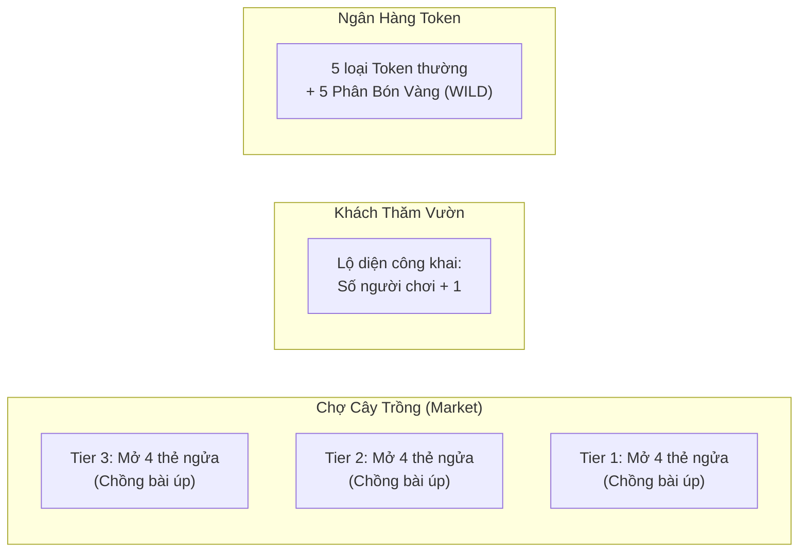
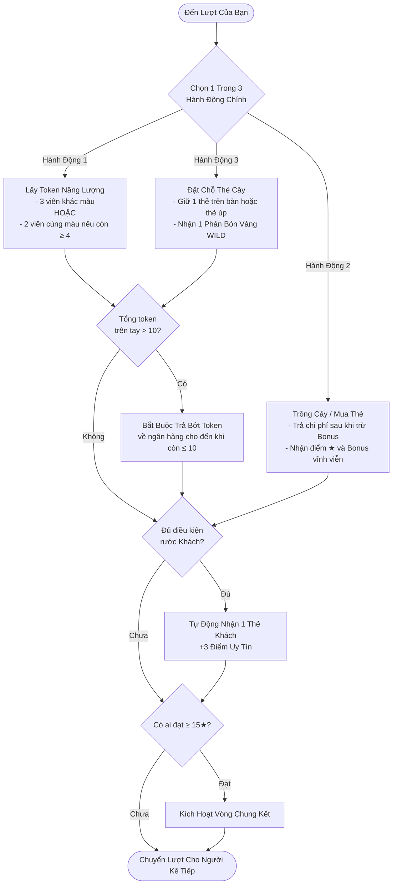

# 📖 CẨM NANG HƯỚNG DẪN CÁCH CHƠI — GARDEN EMPIRE (SPLENDOR BOARD GAME)

> **Garden Empire** là tựa game chiến thuật xây dựng động cơ tài nguyên (Engine Building) thời gian thực dành cho **2 đến 4 người chơi**, được chuyển thể và lấy cảm hứng trọn vẹn từ kiệt tác board game đoạt giải quốc tế **[Splendor](https://en.wikipedia.org/wiki/Splendor_(game))** (thiết kế bởi Marc André).
>
> Thay vì vào vai các thương nhân đá quý thời kỳ Phục Hưng, người chơi trong **Garden Empire** sẽ hóa thân thành các **Nghệ nhân thực vật học hoàng gia**, thu thập tinh hoa năng lượng thiên nhiên để ươm mầm các giống cây quý hiếm, thu hút muông thú & linh vật ghé thăm khu vườn, và cạnh tranh để đạt danh hiệu **Bậc Thầy Kiến Tạo Đế Chế Vườn Sinh Thái**.

---

## 📌 MỤC LỤC

1. [Tổng Quan Trò Chơi & Bảng Ánh Xạ Splendor](#1-tổng-quan-trò-chơi--bảng-ánh-xạ-splendor)
2. [Thành Phần Trò Chơi (Game Components)](#2-thành-phần-trò-chơi-game-components)
3. [Thiết Lập Bàn Cờ Theo Số Người Chơi (Setup)](#3-thiết-lập-bàn-cờ-theo-số-người-chơi-setup)
4. [Luật Chơi Chi Tiết & Diễn Biến Lượt Đi (Gameplay)](#4-luật-chơi-chi-tiết--diễn-biến-lượt-đi-gameplay)
   - [Hành Động 1: Lấy Token Năng Lượng (Take Tokens)](#hành-động-1-lấy-token-năng-lượng-take-tokens)
   - [Hành Động 2: Trồng Cây / Mua Thẻ Bài (Buy Plant Card)](#hành-động-2-trồng-cây--mua-thẻ-bài-buy-plant-card)
   - [Hành Động 3: Đặt Chỗ Thẻ Cây (Reserve Plant Card)](#hành-động-3-đặt-chỗ-thẻ-cây-reserve-plant-card)
   - [Hành Động Phụ Tự Động: Trả Token Dư & Rước Khách Thăm Vườn](#hành-động-phụ-tự-động-trả-token-dư--rước-khách-thăm-vườn)
5. [Cơ Chế Giảm Giá Vĩnh Viễn (Engine Building)](#5-cơ-chế-giảm-giá-vĩnh-viễn-engine-building)
6. [Điều Kiện Kết Thúc Ván Đấu & Phân Định Thắng Bại](#6-điều-kiện-kết-thúc-ván-đấu--phân-định-thắng-bại)
7. [Bí Quyết & Chiến Thuật Đỉnh Cao](#7-bí-quyết--chiến-thuật-đỉnh-cao)
8. [Hướng Dẫn Thao Tác Trên Giao Diện Trực Tuyến](#8-hướng-dẫn-thao-tác-trên-giao-diện-trực-tuyến)

---

## 🌿 1. Tổng Quan Trò Chơi & Bảng Ánh Xạ Splendor

Trong trò chơi gốc **Splendor**, người chơi khai thác các mỏ đá quý, vận chuyển và chế tác ngọc để thu hút các nhà quý tộc danh giá. Trong **Garden Empire**, các khái niệm này được khoác lên một diện mạo sinh thái gần gũi nhưng giữ trọn vẹn 100% tính toán chiến thuật:

| Thành Phần Trong Splendor | Tương Đương Trong Garden Empire | Biểu Tượng | Vai Trò & Chức Năng |
|:---|:---|:---:|:---|
| **Onyx (Đá Mã Não Đen)** | **Đất (Earth)** | 🟫 | Tài nguyên nuôi dưỡng rễ cây |
| **Sapphire (Đá Lam Ngọc)** | **Nước (Water)** | 💧 | Nguồn tưới tiêu duy trì sinh khí |
| **Ruby (Đá Hồng Ngọc)** | **Ánh Sáng (Sunlight)** | ☀️ | Năng lượng quang hợp giúp cây nở hoa |
| **Diamond (Đá Kim Cương Trắng)** | **Hạt Giống (Seed)** | 🌰 | Mầm sống thuần khiết bắt đầu sự sống |
| **Emerald (Đá Ngọc Lục Bảo)** | **Dinh Dưỡng (Nutrients)** | 🧪 | Khoáng chất vi lượng tối ưu hóa sinh trưởng |
| **Gold Wild Token (Vàng Tự Do)** | **Phân Bón Vàng (WILD)** | ⭐ | Token vạn năng, thay thế cho bất kỳ loại tài nguyên nào |
| **Development Cards (Thẻ Phát Triển)** | **Thẻ Cây Trồng (Plant Cards)** | 🌱 / 🌿 / 🌳 | Cung cấp Điểm Uy Tín (★) và mức giảm giá vĩnh viễn |
| **Noble Tiles (Quý Tộc Quý Phái)** | **Khách Thăm Vườn (Visitors)** | 🦋 / 🐦 / 🐿️ | Tự động ghé thăm mang lại **+3 Điểm Uy Tín** |
| **Prestige Points (Điểm Danh Vọng)** | **Điểm Uy Tín (Prestige Points)** | ★ | Điểm quyết định chiến thắng (Mục tiêu: $\ge 15★$) |

---

## 🗃️ 2. Thành Phần Trò Chơi (Game Components)

### 1. Chip Năng Lượng / Token (Tổng cộng 40 Token)
- **35 Token Năng Lượng Thường:** Chia đều cho 5 loại (7 Đất, 7 Nước, 7 Ánh Sáng, 7 Hạt Giống, 7 Dinh Dưỡng).
- **5 Token Phân Bón Vàng (WILD ⭐):** Dùng để thay thế cho bất kỳ loại tài nguyên nào khi thanh toán mua cây. Không thể nhặt tự do từ ngân hàng mà chỉ nhận được khi thực hiện hành động **Đặt Chỗ (Reserve)**.

### 2. Bộ Thẻ Cây Trồng (90 Plant Cards)
Chia làm 3 cấp độ (Tier) đại diện cho độ khó, chi phí ươm trồng và phần thưởng điểm uy tín:
- **Tier 1 (Cây Mầm Nhỏ — Viền Xanh Lục 🌱 - 40 Thẻ):** Chi phí rẻ (1–5 token), chủ yếu đem lại giảm giá vĩnh viễn, hiếm khi có điểm (0–1★).
- **Tier 2 (Cây Cảnh & Bụi Cây — Viền Xanh Biển 🌿 - 30 Thẻ):** Chi phí vừa phải (5–8 token), mang lại điểm tầm trung (1–3★) cùng giảm giá thường trực.
- **Tier 3 (Đại Cổ Thụ — Viền Tím Huyền Thoại 🌳 - 20 Thẻ):** Chi phí cao (7–14 token), mang lại lượng điểm lớn (3–5★), là chìa khóa bứt tốc về đích.

*Mỗi thẻ cây bao gồm:*
- **Chi phí (Cost):** Số lượng token từng loại cần trả để trồng.
- **Điểm Uy Tín (Prestige Points):** Con số ngôi sao vàng ở góc trên bên trái thẻ (từ 0 đến 5★).
- **Loại Giảm Giá Vĩnh Viễn (Bonus Resource):** Loại năng lượng hiển thị góc trên bên phải thẻ cây, giúp giảm 1 chi phí cùng loại cho mọi thẻ mua sau này.

### 3. Thẻ Khách Thăm Vườn (10 Visitor Cards)
- Gồm 10 vị khách đặc biệt đại diện cho hệ sinh thái (Ong Chúa, Bướm Hoàng Yến, Bọ Rùa, Chim Ruồi, Sóc Nâu, Nhím Nhỏ, Chuồn Chuồn, Chim Én, Cú Mèo, Kiến Thợ).
- Mỗi thẻ mang lại **3 Điểm Uy Tín (3★)**.
- Khách có yêu cầu nghiêm ngặt về số lượng cây trồng mà người chơi sở hữu (ví dụ: cần 4 cây Nước + 4 cây Dinh Dưỡng, hoặc 3 cây Đất + 3 cây Hạt Giống + 3 cây Ánh Sáng).

---

## ⚖️ 3. Thiết Lập Bàn Cờ Theo Số Người Chơi (Setup)

Hệ thống của **Garden Empire** tự động cân bằng bàn cờ theo chuẩn giải đấu quốc tế Splendor dựa trên số lượng người chơi có mặt trong phòng đấu (từ 2 đến 4 người):



### Bảng Điều Chỉnh Số Lượng Theo Người Chơi:

| Yếu Tố Thiết Lập | 2 Người Chơi | 3 Người Chơi | 4 Người Chơi |
|:---|:---:|:---:|:---:|
| **Số Token thường mỗi loại** | **4 token** | **5 token** | **7 token** |
| **Tổng số Token thường** | 20 token | 25 token | 35 token |
| **Số Token Phân Bón Vàng (WILD ⭐)** | **5 token** *(Cố định)* | **5 token** *(Cố định)* | **5 token** *(Cố định)* |
| **Số Khách Thăm Vườn lộ diện** | **3 khách** | **4 khách** | **5 khách** |
| **Số Thẻ Cây mở ngửa mỗi Tier** | 4 thẻ / Tier (tổng 12 thẻ) | 4 thẻ / Tier (tổng 12 thẻ) | 4 thẻ / Tier (tổng 12 thẻ) |
| **Thẻ đặt chỗ tối đa trên tay** | 3 thẻ / người | 3 thẻ / người | 3 thẻ / người |
| **Giới hạn token cầm tay** | 10 token / người | 10 token / người | 10 token / người |
| **Ngưỡng điểm kích hoạt Chung Kết** | **15 Điểm Uy Tín** | **15 Điểm Uy Tín** | **15 Điểm Uy Tín** |

> [!NOTE]
> - Token Phân Bón Vàng (WILD ⭐) **không bao giờ bị giảm bớt**, luôn luôn có đúng **5 viên** trong ngân hàng bất kể số người chơi.
> - Số Khách Thăm Vườn luôn được tính theo công thức: $\text{Số Khách} = \text{Số Người Chơi} + 1$. Các thẻ khách còn lại sẽ nằm trong xấp bài úp và không được sử dụng trong ván đấu đó.

---

## 🎲 4. Luật Chơi Chi Tiết & Diễn Biến Lượt Đi (Gameplay)

Người chơi đi đầu tiên được hệ thống chỉ định ngẫu nhiên khi ván đấu bắt đầu. Vòng chơi diễn ra theo chiều kim đồng hồ.

Trong lượt của mình, người chơi **bắt buộc phải thực hiện ĐÚNG 1 trong 3 hành động chính** sau:



---

### Hành Động 1: Lấy Token Năng Lượng (Take Tokens)

Người chơi bổ sung tài nguyên vào kho của mình bằng 1 trong 2 cách:

1. **Lấy 3 viên token thuộc 3 loại khác màu nhau:**
   - Ví dụ: 1 Đất 🟫 + 1 Nước 💧 + 1 Ánh Sáng ☀️.
   - *Lưu ý:* Không được lấy Phân Bón Vàng (WILD ⭐) bằng hành động này.
   - *Trường hợp đặc biệt:* Nếu trong ngân hàng chỉ còn lại ít hơn 3 loại token thường, người chơi chỉ được lấy tối đa mỗi loại 1 viên trong số các loại còn lại.

2. **Lấy 2 viên token cùng 1 loại:**
   - **Điều kiện tiên quyết:** Chồng token của loại tài nguyên đó trong ngân hàng phải **còn từ 4 viên trở lên** tại thời điểm bốc bài.
   - *Ví dụ:* Ngân hàng còn 4 viên Nước 💧, bạn được phép lấy 2 viên Nước. Nếu ngân hàng chỉ còn 3 viên Nước, hành động này là **không hợp lệ**.

---

### Hành Động 2: Trồng Cây / Mua Thẻ Bài (Buy Plant Card)

Người chơi đưa một thẻ cây vào khu vườn của mình:
- Có thể mua **1 thẻ cây đang mở ngửa trên bàn cờ** (thuộc Tier 1, Tier 2 hoặc Tier 3).
- HOẶC mua **1 thẻ cây đã được đặt chỗ trước đó trên tay mình**.

#### Quy tắc thanh toán:
1. **Tính mức giảm giá thường trực:** Đếm số lượng biểu tượng giảm giá (Bonus) tương ứng mà bạn đã tích lũy từ các cây đã trồng trước đó. Lấy chi phí trên thẻ bài trừ đi mức giảm giá này.
2. **Chi trả bằng Token:** Trả số lượng token tương ứng từ tay mình về lại Ngân Hàng.
3. **Sử dụng Phân Bón Vàng (WILD ⭐):** Bạn có thể dùng 1 hoặc nhiều token WILD để bù đắp cho bất kỳ loại tài nguyên nào bạn còn thiếu.
4. **Quyền lợi nhận được:**
   - Cây được đưa vĩnh viễn vào khu vườn của bạn.
   - Bạn nhận ngay số **Điểm Uy Tín (★)** ghi trên thẻ.
   - Bạn nhận vĩnh viễn **1 mức giảm giá (Bonus)** thuộc loại tài nguyên của cây đó cho tất cả các lượt mua cây về sau.
5. **Lấp đầy bàn cờ:** Nếu bạn mua thẻ cây từ bàn cờ, rút ngay lá bài trên cùng từ xấp bài cùng Tier để lấp vào ô trống vừa mua.

---

### Hành Động 3: Đặt Chỗ Thẻ Cây (Reserve Plant Card)

Đây là hành động vừa mang tính tích lũy vừa mang tính chiến thuật kiềm tỏa đối thủ:

1. **Chọn thẻ muốn đặt chỗ:**
   - Chọn **1 trong 12 thẻ cây đang mở ngửa** trên bàn cờ; HOẶC
   - Bốc giấu kín **lá bài trên cùng của bất kỳ xấp bài úp nào** (Tier 1, Tier 2 hoặc Tier 3).
2. **Nhận Phân Bón Vàng:** Bạn nhận ngay **1 viên Phân Bón Vàng (WILD ⭐)** từ ngân hàng vào tay (nếu ngân hàng còn WILD. Nếu ngân hàng hết WILD, bạn vẫn được quyền đặt chỗ nhưng không nhận được vàng).
3. **Lấp đầy bàn cờ:** Nếu lấy thẻ ngửa trên bàn, rút ngay thẻ bài mới cùng Tier lấp vào vị trí trống.
4. **Giới hạn nghiêm ngặt:**
   - Mỗi người chơi **chỉ được giữ tối đa 3 thẻ cây đặt chỗ trên tay cùng một lúc**.
   - Khi đã cầm đủ 3 thẻ đặt chỗ, bạn **không thể** thực hiện hành động Đặt Chỗ nữa cho đến khi trồng bớt ít nhất một thẻ.
   - Các thẻ đặt chỗ sẽ ở trên tay bạn cho đến khi bạn quyết định trồng chúng ở các lượt sau (bằng Hành Động 2), và không bao giờ bị đối thủ cướp mất hay bị hủy bỏ.

---

### Hành Động Phụ Tự Động: Trả Token Dư & Rước Khách Thăm Vườn

Sau khi hoàn tất hành động chính, hệ thống sẽ tự động kích hoạt 2 bước kiểm tra theo thứ tự:

#### 1. Kiểm tra giới hạn 10 Token (Token Limit Check):
- Tổng số token trên tay (bao gồm cả token thường và Phân Bón Vàng WILD) **không được vượt quá 10 viên** vào cuối lượt.
- Nếu sau khi bốc token hoặc nhận WILD mà tổng số token của bạn $> 10$, hệ thống sẽ hiển thị bảng yêu cầu bạn **trả lại số token dư thừa vào ngân hàng** cho đến khi trên tay còn chính xác $\le 10$ viên. Bạn có toàn quyền chọn loại token nào để trả lại.

#### 2. Rước Khách Thăm Vườn (Noble Visit Check):
- Hệ thống tự động đối chiếu số lượng **Bonus giảm giá vĩnh viễn** bạn đang có với điều kiện của các thẻ Khách Thăm Vườn đang mở trên bàn.
- Nếu khu vườn của bạn thỏa mãn trọn vẹn điều kiện của một vị khách, vị khách đó sẽ **tự động bay về vườn của bạn**:
  - Bạn nhận ngay **+3 Điểm Uy Tín (3★)**.
  - Vị khách đó rời khỏi bàn cờ và không có lá khách nào khác thay thế.
- **Lưu ý quan trọng:**
  - Khách thăm vườn ghé thăm hoàn toàn tự động và **không tiêu tốn bất kỳ lượt hay tài nguyên nào** của bạn.
  - Nếu khu vườn của bạn cùng lúc đủ điều kiện thu hút từ 2 vị khách trở lên, hệ thống sẽ chọn rước **đúng 1 vị khách trong lượt đó**. Vị khách còn lại sẽ được rước ở lượt kế tiếp nếu bạn vẫn duy trì đủ điều kiện.

---

## ⚡ 5. Cơ Chế Giảm Giá Vĩnh Viễn (Engine Building)

Sức hấp dẫn lớn nhất của Splendor và **Garden Empire** nằm ở cơ chế **xây dựng guồng máy tích lũy (Engine Building)**:

```text
Ví dụ minh họa:
Bạn muốn trồng cây "Cổ Thụ Sequoia" (Tier 3) có giá:
- 3 Đất 🟫
- 3 Hạt Giống 🌰
- 5 Nước 💧
- 3 Dinh Dưỡng 🧪

Hiện tại trong vườn của bạn đã trồng sẵn các cây nhỏ mang lại:
- 2 Bonus Đất 🟫
- 1 Bonus Hạt Giống 🌰
- 3 Bonus Nước 💧

Chi phí thực tế bạn phải trả chỉ còn lại:
- 1 Đất 🟫 (3 - 2 = 1)
- 2 Hạt Giống 🌰 (3 - 1 = 2)
- 2 Nước 💧 (5 - 3 = 2)
- 3 Dinh Dưỡng 🧪 (3 - 0 = 3)

Nếu bạn có thêm 2 viên Phân Bón Vàng (WILD ⭐), bạn chỉ cần dùng:
- 1 Đất + 2 Hạt Giống + 2 Nước + 1 Dinh Dưỡng + 2 WILD!
```

> [!TIP]
> Khi bạn đã xây dựng được một mạng lưới cây trồng phong phú với nhiều điểm Bonus, bạn có thể **trồng các cây cấp cao hoàn toàn miễn phí (0 Token)** mà không tốn bất kỳ tài nguyên nào trong kho!

---

## 🏆 6. Điều Kiện Kết Thúc Ván Đấu & Phân Định Thắng Bại

### Kích Hoạt Vòng Chung Kết (Final Round):
- Ngay khi có bất kỳ người chơi nào đạt **từ 15 Điểm Uy Tín (★) trở lên**, vòng đấu hiện tại sẽ được đánh dấu là **Vòng Chung Kết (Final Round)**.
- Trận đấu **chưa dừng lại ngay lập tức**! Ván cờ sẽ tiếp tục diễn ra cho đến khi **người chơi cuối cùng trong chu kỳ hoàn thành lượt của mình** (tức là người chơi ngồi ngay trước người đi đầu tiên).
- Cơ chế này đảm bảo **tất cả người chơi trong ván đều có số lượt đi hoàn toàn bằng nhau**, mang lại tính công bằng tuyệt đối.

### Xác Định Tân Vương Đế Chế Vườn:
1. **Tiêu chí 1 (Điểm Uy Tín):** Người chơi sở hữu tổng số Điểm Uy Tín cao nhất sẽ giành chiến thắng 👑.
2. **Tiêu chí phụ (Tie-breaker khi hòa điểm):** Nếu có từ 2 người chơi trở lên bằng điểm uy tín nhau:
   - Hệ thống sẽ đếm tổng số lượng Thẻ Cây mà mỗi người đã mua trong suốt ván đấu.
   - **Người chơi nào mua ÍT THẺ CÂY HƠN sẽ giành chiến thắng!** (Bởi vì người đó đã tối ưu hóa chiến lược hiệu quả hơn, mua những cây đắt giá và chất lượng hơn thay vì mua dàn trải).

---

## 🧠 7. Bí Quyết & Chiến Thuật Đỉnh Cao

Dưới đây là những kinh nghiệm từ các kỳ thủ Splendor đẳng cấp thế giới được áp dụng hoàn hảo trong Garden Empire:

### 1. Chiến Lược "Xây Nền Móng Vững Chắc" (Engine Strategy)
- Tập trung gom các thẻ Tier 1 chi phí thấp (chi phí 1–3 token) trong 4–6 lượt đầu tiên.
- Không quá bận tâm về điểm số ban đầu, mục tiêu là có từ 5–8 điểm Bonus đa dạng để biến các lượt sau thành chuỗi mua cây miễn phí.
- Phù hợp khi chơi bàn 3–4 người, nơi tài nguyên token trong ngân hàng thường xuyên bị tranh giành cạn kiệt.

### 2. Chiến Lược "Tốc Biến Cổ Thụ" (Rush Tier 3 Strategy)
- Không mua nhiều thẻ Tier 1. Chỉ nhặt token tập trung vào 2–3 màu chủ lực của các thẻ Tier 2 và Tier 3 có điểm uy tín cao (3★ đến 5★).
- Dùng tính năng Đặt Chỗ (Reserve) để vừa khóa thẻ mục tiêu vừa lấy Phân Bón Vàng WILD bù đắp tài nguyên thiếu.
- Kết thúc ván đấu cực nhanh chỉ trong khoảng 20–25 lượt đi, khiến đối thủ chưa kịp vận hành xong cỗ máy giảm giá.

### 3. "Khóa Bài" & Phá Chiến Thuật Đối Thủ (Hate-Drafting / Defensive Reserve)
- Luôn quan sát bảng tài nguyên và kho cây của các đối thủ bên cột trái.
- Nếu thấy đối thủ đang tích đủ tài nguyên để chuẩn bị mua một cây 4★ hoặc sắp đủ điều kiện rước Khách Thăm Vườn, hãy nhanh tay dùng hành động **Đặt Chỗ (Reserve)** để cướp lá bài đó về tay mình!
- Vừa chặn đứng đường tiến của đối thủ, vừa mang về cho mình 1 viên Phân Bón Vàng quý giá.

### 4. Tận Dụng Sức Mạnh Của Khách Thăm Vườn (+3★)
- 3 Điểm Uy Tín từ một vị khách bằng điểm của cả một cây Tier 2 hoặc Tier 3 lớn.
- Hãy quan sát danh sách các Khách Thăm Vườn lộ diện ngay từ đầu trận và định hướng trồng các loại cây mà các vị khách yêu cầu.
- Ai rước được từ 1 đến 2 vị khách hầu như luôn nắm giữ trên 70% cơ hội chạm tay vào chiếc cúp vô địch.

---

## 🖥️ 8. Hướng Dẫn Thao Tác Trên Giao Diện Trực Tuyến

Khi tham gia trận đấu tại [Garden Empire](https://garden-empire-game.vercel.app) hoặc máy chủ nội bộ:

```text
┌─────────────────────────────────────────────────────────────────────────────┐
│ 🌿 GARDEN EMPIRE  |  MÃ PHÒNG: ABCXYZ  |  LƯỢT: Bạn [30s]  | 🔊 [Luật] [Rời] │
├───────────────────────┬─────────────────────────────┬───────────────────────┤
│ 👥 ĐỐI THỦ (Left)     │ 🦋 KHÁCH THĂM VƯỜN (Nobles) │ 🪴 XƯỞNG CỦA BẠN (R)  │
│ - Người chơi 2        │ [Khách 1] [Khách 2] [Khách 3]│ - Điểm: 12 / 15★      │
│ - Người chơi 3        ├─────────────────────────────┤ - Thanh tiến độ       │
│                       │ 🌳 CHỢ CÂY TRỒNG (Market)   │                       │
│ 📜 NHẬT KÝ VÁN ĐẤU    │ [Tier 3: 4 Thẻ Mở Ngửa]     │ 📦 TOKEN CẦM TAY      │
│ - Tom trồng Sen Đá    │ [Tier 2: 4 Thẻ Mở Ngửa]     │ [🟫 2] [💧 1] [⭐ 1]  │
│ - Jerry lấy 3 token   │ [Tier 1: 4 Thẻ Mở Ngửa]     │ (Tối đa 10)           │
│                       ├─────────────────────────────┤ 🌿 GIẢM GIÁ BONUS     │
│                       │ 🪙 NGÂN HÀNG NĂNG LƯỢNG     │ [🟫 +2] [💧 +3]       │
│                       │ [🟫] [💧] [☀️] [🌰] [🧪] [⭐]│ 📑 THẺ ĐẶT CHỖ (Max 3)│
│                       │ [Nút: Lấy Tài Nguyên]       │ [Thẻ 1] [Thẻ 2] [Trống]│
└───────────────────────┴─────────────────────────────┴───────────────────────┘
```

1. **Lấy Token:**
   - Nhấp vào nút **"Lấy Tài Nguyên"** hoặc nhấp trực tiếp vào các viên ngọc trong Ngân Hàng Năng Lượng.
   - Chọn 3 viên khác màu hoặc 2 viên cùng màu trong bảng chọn popup, sau đó bấm **"Xác Nhận Lấy"**.
2. **Mua Hoặc Đặt Chỗ Cây Trồng:**
   - Nhấp chuột trực tiếp vào bất kỳ thẻ cây nào trên Chợ Cây Trồng (Tier 1, 2, 3) hoặc trong khay thẻ đặt chỗ của bạn.
   - Cửa sổ chi tiết thẻ sẽ hiện lên, tính toán rõ số token bạn cần chi trả và số token vàng sẽ tiêu thụ:
     - Nhấp **"Trồng Cây (Mua)"** nếu bạn đủ điều kiện thanh toán.
     - Nhấp **"Đặt Chỗ (Giữ)"** nếu bạn muốn giữ thẻ về tay và nhận 1 Phân Bón Vàng WILD ⭐.
3. **Đặt chỗ thẻ bài úp từ xấp bài:**
   - Nhấp trực tiếp vào biểu tượng xấp bài úp ở đầu mỗi hàng Tier 1, Tier 2 hoặc Tier 3 để giữ thẻ bí mật.
4. **Theo Dõi Đối Thủ:**
   - Cột bên trái hiển thị chi tiết số điểm uy tín, số token cầm tay, số lượng giảm giá bonus của từng người chơi khác giúp bạn tính toán đối sách kịp thời.

---

<div align="center">
  🌿 <i>Chúc bạn có những giờ phút đấu trí tuyệt vời và sớm xây dựng nên một Đại Đế Chế Vườn Sinh Thái huy hoàng!</i> 🌿
</div>
