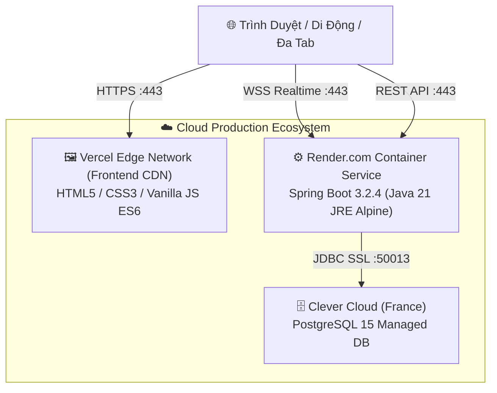

# 🌿 GARDEN EMPIRE — CHIẾN THUẬT KHU VƯỜN ĐẾ CHẾ

> **Một trò chơi bàn cờ chiến thuật thời gian thực lấy cảm hứng từ kiệt tác Splendor, kết hợp chủ đề xây dựng vườn sinh thái, tối ưu hóa tài nguyên và tranh đoạt điểm danh tiếng vĩnh viễn.**

<div align="center">

[](https://garden-empire-game.vercel.app)

[](https://garden-empire-game.vercel.app) [](https://gardenempiregame.onrender.com) [](https://console.clever-cloud.com) [](https://console.clever-cloud.com) [](https://openjdk.org/) [](https://spring.io/projects/spring-boot) [](https://www.docker.com/)

</div>

---

## 📌 MỤC LỤC

1. [Giới Thiệu Trò Chơi](#-1-giới-thiệu-trò-chơi)
2. [Cốt Truyện & Luật Chơi Cốt Lõi](#-2-cốt-truyện--luật-chơi-cốt-lõi)
3. [Kiến Trúc Kỹ Thuật (Tech Stack)](#-3-kiến-trúc-kỹ-thuật-tech-stack)
4. [Cấu Trúc Thư Mục Dự Án](#-4-cấu-trúc-thư-mục-dự-án)
5. [Hướng Dẫn Cài Đặt & Chạy Môi Trường Local](#-5-hướng-dẫn-cài-đặt--chạy-môi-trường-local)
   - [Chạy với Docker Compose (Khuyên dùng)](#cách-1-chạy-1-click-bằng-docker-compose-khuyên-dùng)
   - [Chạy thủ công không dùng Docker](#cách-2-chạy-thủ-công-không-dùng-docker)
6. [Triển Khai Production & Cloud Hosting](#-6-triển-khai-production--cloud-hosting)
7. [Kiểm Thử Tự Động (Testing & E2E)](#-7-kiểm-thử-tự-động-testing--e2e)

---

## 🌿 1. Giới Thiệu Trò Chơi

**Garden Empire** đưa người chơi vào vai các nghệ nhân thực vật học tài hoa, cạnh tranh kiến tạo khu vườn thượng uyển tráng lệ nhất vương quốc:
- **Thu thập năng lượng thiên nhiên** (Đất, Nước, Ánh Sáng, Hạt Giống, Dinh Dưỡng, Phân Bón Vàng).
- **Nuôi trồng thẻ cây** thuộc 3 cấp độ (Tier 1, Tier 2, Tier 3) để tích lũy điểm uy tín vĩnh viễn và tạo hiệu ứng giảm giá mua cây tiếp theo.
- **Rước các Vị Khách Quý Tộc & Linh Vật** (Chim én, Bọ rùa, Nhà thực vật học...) khi khu vườn hội tụ đủ các tiêu chí thực vật đặc sắc.
- **Phòng chờ & Quản lý chủ phòng (Waiting Room):** Quản lý chủ phòng (Room Host), chỉ chủ phòng có quyền bắt đầu trận đấu khi đủ 2–4 người chơi, tính năng kick người chơi kèm lệnh cấm 2 phút (cooldown ban) và chọn ngẫu nhiên lượt đi đầu tiên.
- **Đồng bộ đa người chơi thời gian thực (Real-time Multiplayer)** với độ trễ thấp thông qua WebSocket Native.

---

## 🎲 2. Cốt Truyện & Luật Chơi Cốt Lõi

### 🔹 Hệ Thống Tài Nguyên (6 Loại Năng Lượng)
| Tài Nguyên | Biểu Tượng | Mô Tả |
|---|:---:|---|
| **Đất (Dirt)** | 🟫 | Đất phù sa màu mỡ nuôi dưỡng rễ cây |
| **Nước (Water)** | 💧 | Nguồn tưới tiêu trong lành duy trì sinh khí |
| **Ánh Sáng (Sunlight)** | ☀️ | Năng lượng quang hợp giúp cây vươn cao |
| **Hạt Giống (Seed)** | 🌰 | Mầm sống thuần khiết bắt đầu sự sống |
| **Chất Dinh Dưỡng (Nutrient)** | 🧪 | Khoáng chất vi lượng tối ưu hóa sinh trưởng |
| **Phân Bón Vàng (Wild)** | ⭐ | Năng lượng đa năng (vàng) thay thế cho bất kỳ tài nguyên nào |

### 🔹 3 Hành Động Trong Lượt (Mỗi lượt chỉ chọn 1):
1. **Lấy Token Năng Lượng:**
   - Lấy **3 viên token khác màu nhau**, HOẶC
   - Lấy **2 viên token cùng màu** (chỉ khả dụng khi chồng token đó trong ngân hàng còn $\ge 4$ viên).
   - *Giới hạn cầm tay:* Tối đa **10 token**.
2. **Mua & Trồng Cây (Plant Card):**
   - Trả chi phí token tương ứng trên thẻ bài (đã trừ đi mức giảm giá thường trực từ các cây đã trồng trước đó).
   - Nhận điểm danh tiếng (★) và mức giảm giá vĩnh viễn cho các lần mua tiếp theo.
3. **Đặt Chỗ Thẻ Cây (Reserve Card):**
   - Đặt chỗ bí mật 1 thẻ cây trên bàn hoặc thẻ úp từ bộ bài vào tay (tối đa giữ **3 thẻ**).
   - Nhận ngay **1 viên Phân Bón Vàng (WILD ⭐)** (nếu ngân hàng còn).

### 🔹 Vòng Chung Kết & Chiến Thắng (15 Điểm):
- Khi có bất kỳ nghệ nhân nào chạm mốc **$\ge 15$ điểm uy tín (★)**, hệ thống kích hoạt **Vòng Chung Kết (Final Round)**.
- Vòng đấu sẽ tiếp tục cho đến khi người chơi cuối cùng trong chu kỳ hoàn thành lượt đi (đảm bảo tất cả người chơi đều có số lượt đánh ngang nhau).
- Người có điểm uy tín cao nhất sẽ giành chiến thắng. Trường hợp hòa điểm, người trồng ít cây hơn (tối ưu chi phí hơn) sẽ giành cúp vô địch 🏆.

### 🔹 Thiết Lập Bàn Cờ Theo Số Người Chơi:
| Số Người Chơi | Token Thường Mỗi Loại | Token Vàng (WILD ⭐) | Khách Thăm Vườn Lộ Diện | Thẻ Cây Mở Ngửa |
|:---:|:---:|:---:|:---:|:---:|
| **2 Người** | 4 viên (tổng 20) | 5 viên | 3 khách | 4 thẻ / Tier (tổng 12) |
| **3 Người** | 5 viên (tổng 25) | 5 viên | 4 khách | 4 thẻ / Tier (tổng 12) |
| **4 Người** | 7 viên (tổng 35) | 5 viên | 5 khách | 4 thẻ / Tier (tổng 12) |

> 📖 **Xem cẩm nang luật chơi và hướng dẫn chiến thuật chi tiết tại:** [.doc/how_to_play.md](.doc/how_to_play.md)

---

## ⚙️ 3. Kiến Trúc Kỹ Thuật (Tech Stack)



- **Frontend:** HTML5 Semantic, Vanilla CSS3 (Glassmorphism & Natural Emerald Palette), Vanilla JavaScript ES6 Modules.
- **Backend:** Java 21 LTS, Spring Boot 3.2.4 (Spring Web, Spring WebSocket, Spring Data JPA, HikariCP, Lombok, Jackson).
- **Concurrency & State:** Quản lý trạng thái bàn cờ với `ConcurrentHashMap` và khóa đồng bộ hóa chống race-condition bằng `ReentrantLock`.
- **Database:** PostgreSQL 15 trên Clever Cloud với cơ chế connection pool tối ưu.
- **Containerization:** Docker Multi-stage build (Maven 3.9 builder $\rightarrow$ Eclipse Temurin 21 JRE Alpine), Nginx Alpine Reverse Proxy.
- **Audio Engine:** Web Audio API tự động tổng hợp sóng âm thanh thiên nhiên thời gian thực (không phụ thuộc file media ngoài).

## 📂 4. Cấu Trúc Thư Mục Dự Án

```text
GardenEmpireGame/
├── .doc/                            # Tài liệu dự án & hướng dẫn chi tiết
│   ├── how_to_play.md               # Cẩm nang luật chơi Splendor & cơ chế Garden Empire
│   └── revelant_links.md            # Tổng hợp liên kết tham khảo & tài nguyên
├── .env.example                     # File mẫu biến môi trường (Database, Port)
├── .gitignore                       # Loại trừ build artifacts, IDE, .env
├── docker-compose.yml               # Cấu hình khởi chạy trọn gói Backend + Frontend Nginx
├── vercel.json                      # Cấu hình định tuyến triển khai Vercel CDN
├── README.md                        # Tài liệu hướng dẫn toàn diện dự án
│
├── client/                          # Giao diện Frontend (Vanilla Web)
│   ├── index.html                   # Trang chủ: Đặt tên biệt danh, chọn linh vật vườn
│   ├── lobby.html                   # Sảnh chờ: Duyệt phòng, tạo phòng, vào bằng mã code
│   ├── waiting-room.html            # Phòng chờ: Danh sách thành viên, quyền chủ phòng, kick & bắt đầu
│   ├── game.html                    # Bàn cờ chính: Hiển thị chợ cây, ngân hàng, thẻ đối thủ
│   ├── favicon.svg                  # Biểu tượng Favicon SVG vector 1:1 sắc nét
│   ├── favicon.png                  # Biểu tượng Favicon PNG 512x512
│   ├── robots.txt                   # Điều hướng bot tìm kiếm (Google, Bing)
│   ├── sitemap.xml                  # Sơ đồ trang web chuẩn SEO
│   ├── Dockerfile                   # Nginx Alpine phục vụ static files & reverse proxy
│   ├── nginx.conf                   # Cấu hình reverse proxy /api và /ws
│   ├── assets/
│   │   └── images/
│   │       ├── garden_empire.jpg    # Banner xem trước chuẩn 1200x675 (~250KB) cho Zalo, Facebook
│   │       └── garden_empire.png    # Ảnh poster sinh thái chất lượng cao
│   ├── css/
│   │   ├── common.css               # Hệ màu thiên nhiên, tokens, version badge, layout glassmorphism
│   │   ├── index.css                # Style thẻ đăng nhập & avatar picker
│   │   ├── lobby.css                # Style thẻ phòng ngang, bảng điều khiển sảnh
│   │   ├── waiting-room.css         # Style phòng chờ: Danh sách người chơi, huy hiệu chủ phòng
│   │   └── game.css                 # Bàn cờ, thẻ cây 3 tầng, ngân hàng ngọc, bảng đối thủ
│   └── js/
│       ├── config.js                # Tự động nhận diện môi trường (Local / Docker / Render Cloud)
│       ├── main.js                  # Xử lý đăng nhập khách & lưu trữ linh vật
│       ├── api/roomApi.js           # Giao tiếp REST API tạo phòng, vào phòng, kick, rời phòng
│       └── ui/
│           ├── BoardUI.js           # Điều phối toàn bộ sự kiện và hoạt ảnh bàn cờ
│           ├── LobbyUI.js           # Render danh sách phòng và cập nhật sảnh chờ
│           ├── WaitingRoomUI.js     # Điều khiển phòng chờ: Host controls, kick ban, WebSocket sync
│           ├── PlayerUI.js          # Render kho thẻ, token cầm tay và điểm số người chơi
│           └── ResourceUI.js        # Render ngân hàng ngọc & trạng thái chip năng lượng
│
├── tests/                           # Kịch bản kiểm thử tích hợp & E2E mô phỏng
│   └── test_multi_tab.js            # Kịch bản kiểm thử E2E giả lập đa người chơi
│
└── server/                          # Máy chủ Backend (Spring Boot 3.2.4)
    ├── pom.xml                      # Quản lý Maven dependencies (Web, WebSocket, JPA, Postgres)
    ├── Dockerfile                   # Multi-stage build (Maven 3.9 -> JRE 21 Alpine)
    └── src/main/java/com/gardenempire/
        ├── GardenEmpireApplication.java # Entry point & kích hoạt @EnableScheduling
        ├── config/                  # Cấu hình WebSocket, CORS, Jackson
        ├── controller/              # REST Endpoints: /api/rooms, /api/games
        ├── dto/                     # Data Transfer Objects: CreateRoomRequest, KickRequest...
        ├── game/                    # GameEngine, CardCatalog, Deck, Player, TokenBank
        ├── room/                    # Room, RoomManager, RoomStatus
        ├── service/                 # GameService, RoomService, RoomCleanupService
        └── websocket/               # GameWebSocketHandler, GameMessageHandler
```

---

## 💻 5. Hướng Dẫn Cài Đặt & Chạy Môi Trường Local

### Yêu Cầu Tiên Quyết:
- **Git** đã cài đặt.
- **Docker Desktop** (nếu chạy bằng Docker) HOẶC **Java 21 LTS & Maven 3.9+** (nếu chạy trực tiếp).

---

### Cách 1: Chạy 1-Click Bằng Docker Compose (Khuyên dùng)
Toàn bộ hệ thống Backend Java 21 và Frontend Nginx sẽ tự động build và chạy trong mạng ảo:

```bash
# 1. Clone repository
git clone https://github.com/Sleepy2608/GardenEmpireGame.git
cd GardenEmpireGame

# 2. Khởi chạy toàn bộ hệ thống
docker compose up -d --build
```
- 🌐 **Truy cập game ngay tại:** [http://localhost:3000](http://localhost:3000)
- ⚙️ **Backend REST API:** [http://localhost:8080/api/rooms](http://localhost:8080/api/rooms)

---

### Cách 2: Chạy Thủ Công Không Dùng Docker

#### 1. Khởi động Backend (Spring Boot):
```bash
cd server
mvn spring-boot:run
```
*(Backend sẽ lắng nghe tại cổng `http://localhost:8080` và WebSocket `ws://localhost:8080/ws/game`).*

#### 2. Khởi động Frontend:
Mở thư mục `client/` bằng bất kỳ Static HTTP Server nào (ví dụ: Live Server trên VS Code, hoặc dùng Node):
```bash
npx serve client -p 3000
```
Truy cập [http://localhost:3000](http://localhost:3000) để trải nghiệm game.

---

## 🌐 6. Triển Khai Production & Cloud Hosting

Dự án hiện đã được đóng gói và triển khai thành công trên môi trường đám mây:

1. **Frontend (Vercel CDN):**
   - URL: [https://garden-empire-game.vercel.app](https://garden-empire-game.vercel.app)
   - Tự động CI/CD khi có commit đẩy lên nhánh `main`.
2. **Backend (Render.com Web Service):**
   - URL: [https://gardenempiregame.onrender.com](https://gardenempiregame.onrender.com)
   - Chạy container Docker Java 21, tự động giữ WebSocket ping/pong ổn định.
3. **Database (Clever Cloud PostgreSQL):**
   - Lưu trữ dữ liệu và kiểm soát connection pool qua biến môi trường an toàn:
     - `SPRING_DATASOURCE_URL`
     - `SPRING_DATASOURCE_USERNAME`
     - `SPRING_DATASOURCE_PASSWORD`

---

## 🧪 7. Kiểm Thử Tự Động (Testing & E2E)

Dự án bao gồm bộ kiểm thử tự động toàn diện:

### 1. Unit & Integration Tests (Spring Boot):
```bash
cd server
mvn test
```
*Kết quả:* **21/21 Unit & Integration Tests PASS 100%**.

### 2. Multi-Tab E2E Simulation Test:
Kiểm thử giả lập 3 người chơi kết nối WebSocket, tạo phòng, bốc ngọc đồng thời và giải phóng phòng:
```bash
node tests/test_multi_tab.js
```

---

## 📜 Giấy Phép & Bản Quyền

Dự án được xây dựng phục vụ mục đích học tập và nghiên cứu công nghệ game thời gian thực.
**Tác giả:** [Nguyen Le Huy Tam (@Sleepy2608)](https://github.com/Sleepy2608)

---

<div align="center">
   🌿<b> Garden Empire Game </b>🌿
</div>