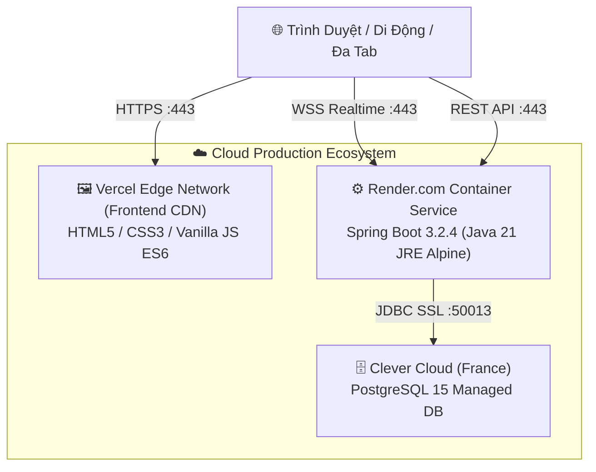

# 🌿 GARDEN EMPIRE — CHIẾN THUẬT KHU VƯỜN ĐẾ CHẾ

> **Một trò chơi bàn cờ chiến thuật thời gian thực lấy cảm hứng từ kiệt tác Splendor, kết hợp chủ đề xây dựng vườn sinh thái, tối ưu hóa tài nguyên và tranh đoạt điểm danh tiếng vĩnh viễn.**

[](https://garden-empire-game.vercel.app)
[](https://gardenempiregame.onrender.com)
[](https://console.clever-cloud.com)
[](https://openjdk.org/)
[](https://spring.io/projects/spring-boot)
[](https://www.docker.com/)

---

## 📌 MỤC LỤC

1. [Giới Thiệu Trò Chơi](#-1-giới-thiệu-trò-chơi)
2. [Cốt Truyện & Luật Chơi Cốt Lõi](#-2-cốt-truyện--luật-chơi-cốt-lõi)
3. [Kiến Trúc Kỹ Thuật (Tech Stack)](#-3-kiến-trúc-kỹ-thuật-tech-stack)
4. [Các Tính Năng Đã Hoàn Thiện (Changelog & Git Log)](#-4-các-tính-năng-đã-hoàn-thiện-changelog--git-log)
5. [Cấu Trúc Thư Mục Dự Án](#-5-cấu-trúc-thư-mục-dự-án)
6. [Hướng Dẫn Cài Đặt & Chạy Môi Trường Local](#-6-hướng-dẫn-cài-đặt--chạy-môi-trường-local)
   - [Chạy với Docker Compose (Khuyên dùng)](#cách-1-chạy-1-click-bằng-docker-compose-khuyên-dùng)
   - [Chạy thủ công không dùng Docker](#cách-2-chạy-thủ-công-không-dùng-docker)
7. [Triển Khai Production & Cloud Hosting](#-7-triển-khai-production--cloud-hosting)
8. [Kiểm Thử Tự Động (Testing & E2E)](#-8-kiểm-thử-tự-động-testing--e2e)

---

## 🌿 1. Giới Thiệu Trò Chơi

**Garden Empire** đưa người chơi vào vai các nghệ nhân thực vật học tài hoa, cạnh tranh kiến tạo khu vườn thượng uyển tráng lệ nhất vương quốc:
- **Thu thập năng lượng thiên nhiên** (Đất, Nước, Ánh Sáng, Hạt Giống, Dinh Dưỡng, Phân Bón Vàng).
- **Nuôi trồng thẻ cây** thuộc 3 cấp độ (Tier 1, Tier 2, Tier 3) để tích lũy điểm uy tín vĩnh viễn và tạo hiệu ứng giảm giá mua cây tiếp theo.
- **Rước các Vị Khách Quý Tộc & Linh Vật** (Chim én, Bọ rùa, Nhà thực vật học...) khi khu vườn hội tụ đủ các tiêu chí thực vật đặc sắc.
- **Đồng bộ đa người chơi thời gian thực (Real-time Multiplayer)** với độ trễ thấp thông qua WebSocket Native.

---

## 🎲 2. Cốt Truyện & Luật Chơi Cốt Lõi

### 🔹 Hệ Thống Tài Nguyên (6 Loại Năng Lượng)
| Tài Nguyên | Biểu Tượng | Mô Tả |
|---|:---:|---|
| **Đất (Earth)** | 🟫 | Đất phù sa màu mỡ nuôi dưỡng rễ cây |
| **Nước (Water)** | 💧 | Nguồn tưới tiêu trong lành duy trì sinh khí |
| **Ánh Sáng (Sunlight)** | ☀️ | Năng lượng quang hợp giúp cây vươn cao |
| **Hạt Giống (Seed)** | 🌰 | Mầm sống thuần khiết bắt đầu sự sống |
| **Dinh Dưỡng (Nutrients)** | 🧪 | Khoáng chất vi lượng tối ưu hóa sinh trưởng |
| **Phân Bón Vàng (Wild)** | ⭐ | Năng lượng đa năng (vàng) thay thế cho bất kỳ tài nguyên nào |

### 🔹 3 Hành Động Trong Lượt (Mỗi lượt chỉ chọn 1):
1. **Lấy Token Năng Lượng:**
   - Lấy **3 viên token khác màu nhau**, HOẶC
   - Lấy **2 viên token cùng màu** (chỉ khả dụng khi chồng token đó trong ngân hàng còn $\ge 4$ viên).
   - *Giới hạn cầm tay:* Tối đa **10 token**.
2. **Mua & Trồng Cây (Plant Card):**
   - Trả chi phí token tương ứng trên thẻ bài (đã trừ đi mức giảm giá thường trực từ các cây đã trồng trước đó).
   - Nhận điểm danh tiếng (★) và mức giảm giá vĩnh viễn cho các lần mua tiếp theo.
3. **Đặt Chỗ Thẻ Cây (Reserve Card):**
   - Đặt chỗ bí mật 1 thẻ cây trên bàn hoặc thẻ úp từ bộ bài vào tay (tối đa giữ **3 thẻ**).
   - Nhận ngay **1 viên Phân Bón Vàng (WILD ⭐)** (nếu ngân hàng còn).

### 🔹 Vòng Chung Kết & Chiến Thắng (15 Điểm):
- Khi có bất kỳ nghệ nhân nào chạm mốc **$\ge 15$ điểm uy tín (★)**, hệ thống kích hoạt **Vòng Chung Kết (Final Round)**.
- Vòng đấu sẽ tiếp tục cho đến khi người chơi cuối cùng trong chu kỳ hoàn thành lượt đi (đảm bảo tất cả người chơi đều có số lượt đánh ngang nhau).
- Người có điểm uy tín cao nhất sẽ giành chiến thắng. Trường hợp hòa điểm, người trồng ít cây hơn (tối ưu chi phí hơn) sẽ giành cúp vô địch 🏆.

---

## ⚙️ 3. Kiến Trúc Kỹ Thuật (Tech Stack)



- **Frontend:** HTML5 Semantic, Vanilla CSS3 (Glassmorphism & Natural Emerald Palette), Vanilla JavaScript ES6 Modules.
- **Backend:** Java 21 LTS, Spring Boot 3.2.4 (Spring Web, Spring WebSocket, Spring Data JPA, HikariCP, Lombok, Jackson).
- **Concurrency & State:** Quản lý trạng thái bàn cờ với `ConcurrentHashMap` và khóa đồng bộ hóa chống race-condition bằng `ReentrantLock`.
- **Database:** PostgreSQL 15 trên Clever Cloud với cơ chế connection pool tối ưu.
- **Containerization:** Docker Multi-stage build (Maven 3.9 builder $\rightarrow$ Eclipse Temurin 21 JRE Alpine), Nginx Alpine Reverse Proxy.
- **Audio Engine:** Web Audio API tự động tổng hợp sóng âm thanh thiên nhiên thời gian thực (không phụ thuộc file media ngoài).

---

## 🚀 4. Các Tính Năng Đã Hoàn Thiện (Changelog & Git Log)

Hệ thống được phát triển và kiểm thử liên tục qua các giai đoạn:

| Commit / Phase | Phân Hệ | Nội Dung Đã Triển Khai |
|---|:---:|---|
| `9e8336a` | **Vercel** | Sửa schema `vercel.json`, loại bỏ trường `public` cũ và kích hoạt rewrites định tuyến tĩnh chuẩn. |
| `c9dc54d` | **Cloud** | Deploy thành công Backend lên **Render.com** (`https://gardenempiregame.onrender.com`), tinh chỉnh HikariCP pool size = 3 cho Clever Cloud. |
| `bd7fee8` / `6fde383` | **Database** | Tích hợp **PostgreSQL Clever Cloud** qua Spring Data JPA; cấu hình bảo mật biến môi trường với `.env` và cập nhật `.gitignore`. |
| `d2eefa2` / `025b7ff` | **Docker** | Xây dựng Dockerfile Multi-stage build cho Spring Boot (Java 21, ZGC, non-root user `garden`); cấu hình Nginx Alpine Reverse Proxy và `docker-compose.yml`. |
| `0ef86d7` / `02b8a07` | **Dọn Dẹp** | Xây dựng `RoomCleanupService` với `@EnableScheduling`: Tự động giải phóng phòng khi ván cờ kết thúc và dọn sạch phòng bỏ hoang sau **5 phút** không có kết nối. |
| `ec0d7eb` / `06d6b50` | **Sảnh Chờ** | Tái thiết kế giao diện danh sách phòng thành dạng thẻ ngang (Horizontal Row Cards); lọc chỉ hiển thị các phòng đang ở trạng thái `WAITING`. |
| `7554165` | **Concurrency** | Kiểm soát luồng với `ReentrantLock` theo từng phòng, chống xung đột tài nguyên khi nhiều người bấm cùng lúc; tự động khôi phục phiên khi F5 / reconnect. |
| `7b79cea` | **Âm Thanh** | Tích hợp **Web Audio API** tổng hợp tiếng chim hót, tiếng suối chảy, âm thanh nhặt ngọc và chuông báo khi đến lượt đi. |
| `c02c5d8` | **Vinh Danh** | Giao diện Bảng Vàng Chiến Thắng (Victory Podium), xếp hạng thứ bậc danh dự và hiển thị điểm số tổng kết. |
| `64f0c98` | **E2E Test** | Bộ kịch bản kiểm thử tự động đa tab giả lập (`test_multi_tab.js`) bao phủ 100% vòng đời một ván đấu Splendor. |

---

## 📂 5. Cấu Trúc Thư Mục Dự Án

```text
GardenEmpireGame/
├── .env.example                     # File mẫu biến môi trường (Database, Port)
├── .gitignore                       # Loại trừ build artifacts, IDE, .env
├── docker-compose.yml               # Cấu hình khởi chạy trọn gói Backend + Frontend Nginx
├── vercel.json                      # Cấu hình định tuyến triển khai Vercel CDN
├── README.md                        # Tài liệu hướng dẫn toàn diện dự án
│
├── client/                          # Giao diện Frontend (Vanilla Web)
│   ├── index.html                   # Trang chủ: Đặt tên biệt danh & chọn linh vật vườn
│   ├── lobby.html                   # Sảnh chờ: Duyệt phòng, tạo phòng, vào bằng mã code
│   ├── game.html                    # Bàn cờ chính: Hiển thị chợ cây, ngân hàng, thẻ đối thủ
│   ├── Dockerfile                   # Nginx Alpine phục vụ static files & reverse proxy
│   ├── nginx.conf                   # Cấu hình reverse proxy /api và /ws
│   ├── css/
│   │   ├── common.css               # Hệ màu thiên nhiên, tokens, animations, layout glassmorphism
│   │   ├── index.css                # Style thẻ đăng nhập & avatar picker
│   │   ├── lobby.css                # Style thẻ phòng ngang, bảng điều khiển sảnh
│   │   └── game.css                 # Bàn cờ, thẻ cây 3 tầng, ngân hàng ngọc, bảng đối thủ
│   └── js/
│       ├── config.js                # Tự động nhận diện môi trường (Local / Docker / Render Cloud)
│       ├── main.js                  # Xử lý đăng nhập khách & lưu trữ linh vật
│       ├── api/roomApi.js           # Giao tiếp REST API tạo phòng, vào phòng, rời phòng
│       └── ui/
│           ├── BoardUI.js           # Điều phối toàn bộ sự kiện và hoạt ảnh bàn cờ
│           ├── LobbyUI.js           # Render danh sách phòng và cập nhật sảnh chờ
│           ├── PlayerUI.js          # Render kho thẻ, token cầm tay và điểm số người chơi
│           └── ResourceUI.js        # Render ngân hàng ngọc & trạng thái chip năng lượng
│
└── server/                          # Máy chủ Backend (Spring Boot 3.2.4)
    ├── pom.xml                      # Quản lý Maven dependencies (Web, WebSocket, JPA, Postgres)
    ├── Dockerfile                   # Multi-stage build (Maven 3.9 -> JRE 21 Alpine)
    ├── test_multi_tab.js            # Kịch bản kiểm thử E2E giả lập đa người chơi
    └── src/main/java/com/gardenempire/
        ├── GardenEmpireApplication.java # Entry point & kích hoạt @EnableScheduling
        ├── config/                  # Cấu hình WebSocket, CORS, Jackson
        ├── controller/              # REST Endpoints: /api/rooms, /api/games
        ├── dto/                     # Data Transfer Objects cho API & WebSocket
        ├── game/                    # GameEngine, CardCatalog, Deck, Player, TokenBank
        ├── room/                    # Room, RoomManager, RoomStatus
        ├── service/                 # GameService, RoomService, RoomCleanupService
        └── websocket/               # GameWebSocketHandler, GameMessageHandler
```

---

## 💻 6. Hướng Dẫn Cài Đặt & Chạy Môi Trường Local

### Yêu Cầu Tiên Quyết:
- **Git** đã cài đặt.
- **Docker Desktop** (nếu chạy bằng Docker) HOẶC **Java 21 LTS & Maven 3.9+** (nếu chạy trực tiếp).

---

### Cách 1: Chạy 1-Click Bằng Docker Compose (Khuyên dùng)
Toàn bộ hệ thống Backend Java 21 và Frontend Nginx sẽ tự động build và chạy trong mạng ảo:

```bash
# 1. Clone repository
git clone https://github.com/Sleepy2608/GardenEmpireGame.git
cd GardenEmpireGame

# 2. Khởi chạy toàn bộ hệ thống
docker compose up -d --build
```
- 🌐 **Truy cập game ngay tại:** [http://localhost:3000](http://localhost:3000)
- ⚙️ **Backend REST API:** [http://localhost:8080/api/rooms](http://localhost:8080/api/rooms)

---

### Cách 2: Chạy Thủ Công Không Dùng Docker

#### 1. Khởi động Backend (Spring Boot):
```bash
cd server
mvn spring-boot:run
```
*(Backend sẽ lắng nghe tại cổng `http://localhost:8080` và WebSocket `ws://localhost:8080/ws/game`).*

#### 2. Khởi động Frontend:
Mở thư mục `client/` bằng bất kỳ Static HTTP Server nào (ví dụ: Live Server trên VS Code, hoặc dùng Node):
```bash
npx serve client -p 3000
```
Truy cập [http://localhost:3000](http://localhost:3000) để trải nghiệm game.

---

## 🌐 7. Triển Khai Production & Cloud Hosting

Dự án hiện đã được đóng gói và triển khai thành công trên môi trường đám mây:

1. **Frontend (Vercel CDN):**
   - URL: [https://garden-empire-game.vercel.app](https://garden-empire-game.vercel.app)
   - Tự động CI/CD khi có commit đẩy lên nhánh `main`.
2. **Backend (Render.com Web Service):**
   - URL: [https://gardenempiregame.onrender.com](https://gardenempiregame.onrender.com)
   - Chạy container Docker Java 21, tự động giữ WebSocket ping/pong ổn định.
3. **Database (Clever Cloud PostgreSQL):**
   - Lưu trữ dữ liệu và kiểm soát connection pool qua biến môi trường an toàn:
     - `SPRING_DATASOURCE_URL`
     - `SPRING_DATASOURCE_USERNAME`
     - `SPRING_DATASOURCE_PASSWORD`

---

## 🧪 8. Kiểm Thử Tự Động (Testing & E2E)

Dự án bao gồm bộ kiểm thử tự động toàn diện:

### 1. Unit & Integration Tests (Spring Boot):
```bash
cd server
mvn test
```
*Kết quả:* **21/21 Unit & Integration Tests PASS 100%**.

### 2. Multi-Tab E2E Simulation Test:
Kiểm thử giả lập 3 người chơi kết nối WebSocket, tạo phòng, bốc ngọc đồng thời và giải phóng phòng:
```bash
node server/test_multi_tab.js
```

---

## 📜 Giấy Phép & Bản Quyền

Dự án được xây dựng phục vụ mục đích học tập và nghiên cứu công nghệ game thời gian thực.
**Tác giả:** [Nguyen Le Huy Tam (@Sleepy2608)](https://github.com/Sleepy2608)